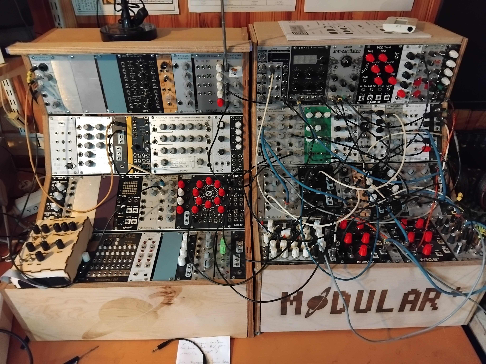
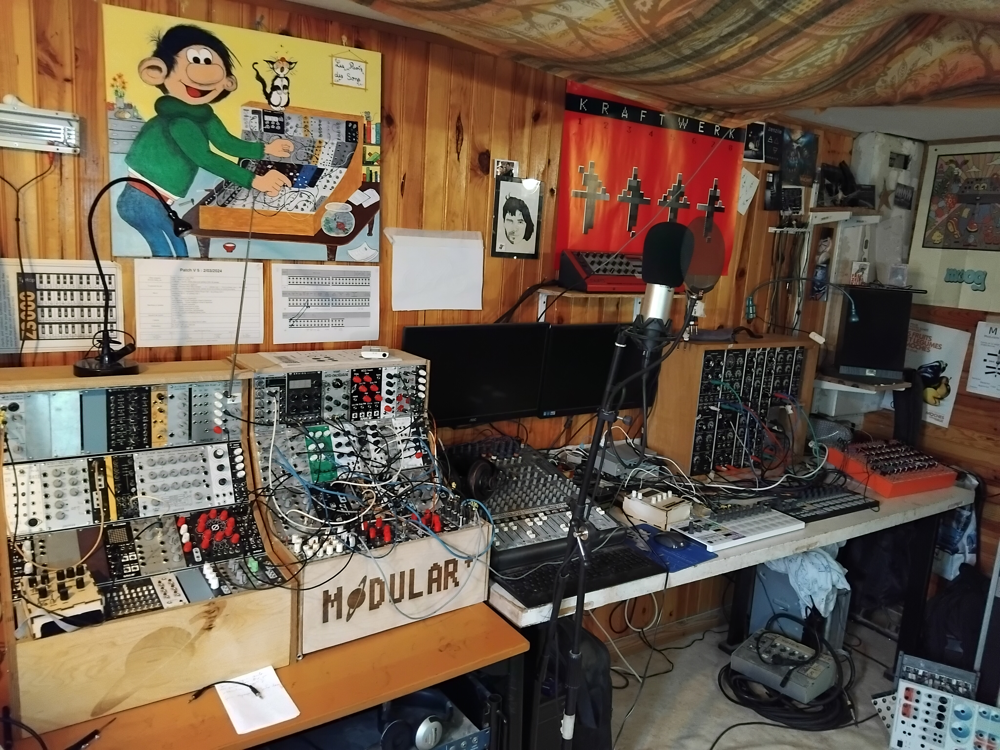

# Modular+_DIY

## About 

* Hi, my name is Yohann. I live in a small town in Brittany in France.

* I use the name of modular+ to build some modular synth :)

* I'm not an electronic engineer, I'm a Maker/Builder/Fixer/Breaker of things since many years :)

* Everything present here works at home. But murphy's law can involve. So I could not be responsible of any injuries with this projects

* Here, you'll see all the data and tricks, research, work, experiments I tried to build some Modular Synth

* I also wanted to thanks all the Synth DIY fellows from the years who shared theirs schemas

My cases

My Studio

**A modular synth is only this few things :)**

## 1 - Case

Build a wood case and add racks to screw the modules.

## 2 - Power supply

Build a power supply. !!! attention - High voltage 220V !!!

It's although possible to buy one if you're not confident enough for building it. 

Bus board for plugging modules.

Build power cable for your modules. 

## 3 - Electronic and Pcb

For yours PCB's', you need a schematic and how to use kicad or other, some electronic design softwares.

You can although find some pcb read to buy or ready to etch (GERBER files)

Or use the old-fashioned handcrafting with chemicals

## 4 - Front panel

To build a front panel 

you need : Inkscape software, a laserCutter (for wood, dibond or pmma) or a PCB supplyer to etch it in PCB material.

## 5 - Knob

To have your customized knobs you need : Freecad software and a 3D printer

# Typical architecture for an eurorack module repository

* The topic of the module, how to use it

* Kicad Project files to allow modifications

* Gerber pcb : Supply GerberPcb.zip for sending to jlcpcb for example to have a board

* Gerber Front panel : Supply GerberPanel.zip for sending to jlcpcb for example to have a front panel

* Schéma : Supply the schematic in .png or pdf and in Kicad files

* iBOM : To have the list of the components needed and where they are on the boards

* Code, if needed : Not very often I guess ^^

* Wiki : how to build with pictures
